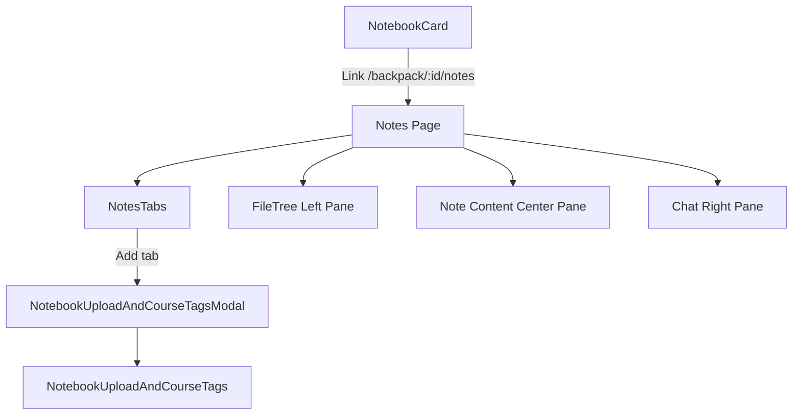

# Notes Workspace UI Architecture

This document describes how the notebook-scoped notes workspace is assembled in the frontend.

## Entry points

- Backpack detail: `frontend/src/app/backpack/[id]/page.tsx`
- Notes workspace: `frontend/src/app/backpack/[id]/notes/page.tsx`
- Notebook card navigation: `frontend/src/components/NotebookCard.tsx`

Notebook cards navigate to the notes workspace using a notebook-scoped route:

- `/backpack/:id/notes`

## Component map

## Behavior notes

- `NotesTabs` controls:
  - open/close left file-tree pane
  - open/close right chat pane
  - tab selection and tab close behavior
  - add-tab action that opens the upload/course-tags modal
- `FileTree` supports:
  - nested folders and files
  - per-folder expand/collapse
  - optional `onSelectFile` callback for wiring selection into note content
- `NotebookUploadAndCourseTagsModal`:
  - renders centered in viewport
  - expects notebook context from the notebook-scoped notes route

## Route conventions

- Primary notes workflow: `/backpack/:id/notes`
- Top-level `/notes` is not the primary workspace entry and should not be the default navigation target.

